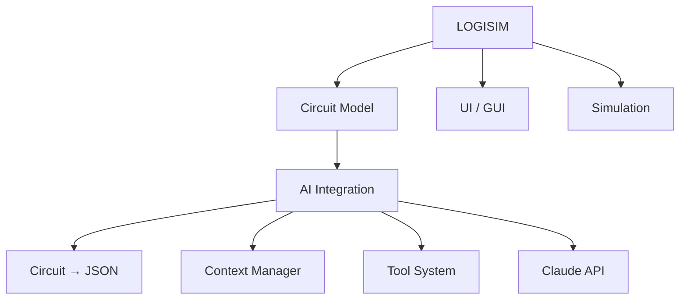

## Global Architecture


# Main Part :
```text
 Logisim Circuit
        │
        ▼
 Circuit Representation
        │
        ▼
   AI Context
        │
        ▼
     Claude
```


# Example of JsON Structure : 


 {
  "circuit": "Main",

  
  "inputs": ["A", "B"],

  
  "outputs": ["OUT"],
  
  

  "components": [
    {
      "id": "and1",
      "type": "AND",
      "inputs": 2
    }

    
  ],

  "connections": [
  
    {"from": "A", "to": "and1.in1"},
    
    
    {"from": "B", "to": "and1.in2"},
    
    {"from": "and1.out", "to": "OUT"}
    
  ]


  
}


# Claude Will :
Claude
   
    read_circuit()
    get_component()
    get_signal()
    simulate()
    add_component()
    remove_component()
    connect()
    modify_component()


 
