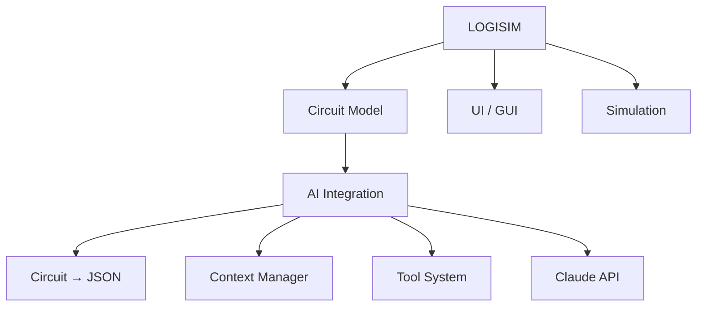

## Global Architecture

```mermaid


flowchart TD
    LOGISIM --> CM[Circuit Model]
    LOGISIM --> UI[UI / GUI]
    LOGISIM --> SIM[Simulation]

    CM --> AI[AI Integration]
    
    AI --> CJ[Circuit → JSON]
    AI --> CTX[Context Manager]
    AI --> TS[Tool System]
    AI --> API[Claude API]
```
